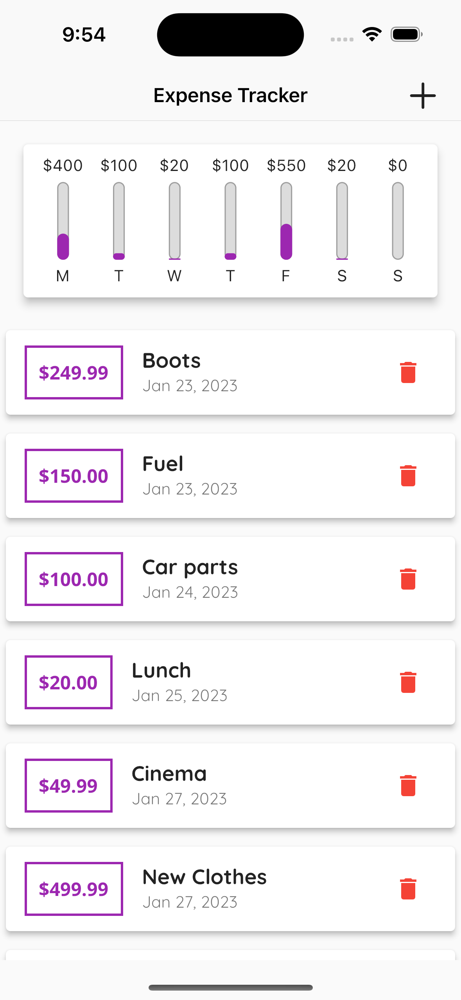
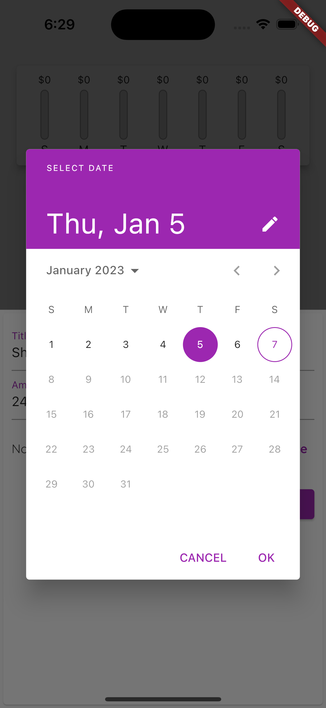
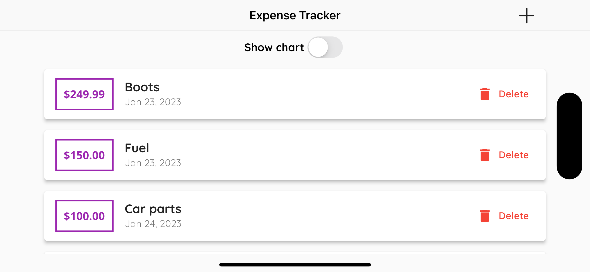

# Expense Tracker in Flutter

This is an expense tracking app developed in Flutter. It allows users to add, edit, and delete expenses, view their spending history and view their spendings on a chart. The app is designed to be simple and easy to use, making it a great tool for managing personal finances.

### Features

- Add, edit, and delete expenses
- View spending history and statistics
- View expenses on a chart for better visualization

### Getting Started

These instructions will get you a copy of the project up and running on your local machine for development and testing purposes.

#### Prerequisites

- Flutter SDK
- Android Studio or Visual Studio Code with the Dart extension installed

#### Installing

1. Clone the repository

```sh
git clone https://github.com/kopiHyper/expenses_tracker.git
```

2. Navigate to the project directory

```sh
cd expense-tracker
```

3. Install the dependencies

```sh
flutter pub get
```

4. Run the app

```sh
flutter run
```

### Built With

- [Flutter](https://flutter.dev/) - The mobile app development framework used
- [Dart](https://dart.dev/) - The programming language used

### Author

- **Oktawian** - [kopiHyper](https://github.com/kopiHyper)


### App preview
- Portrait mode

<div style="display: flex;">
  
  
  
</div>

- Landscape mode

<div style="display: flex;">
  
  
</div>

